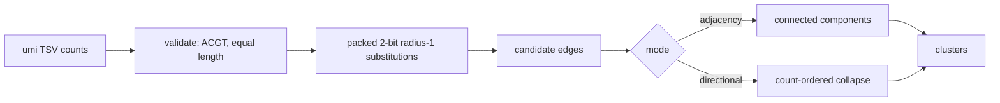

# umi-collapse

[](https://github.com/bmouler/umi-collapse/actions/workflows/ci.yml)


[](LICENSE)

Deterministic, dependency-free UMI error correction for tabular DNA counts. It
provides a transparent all-pairs adjacency baseline, an indexed radius-one
implementation, and directional clustering using the UMI-tools criterion
`high >= 2 * low - 1`.

## Installation

```console
python -m pip install umi-collapse
```

For development and the benchmark:

```console
python -m pip install -e '.[dev]'
pytest --cov=umi_collapse --cov-branch --cov-fail-under=100
```

## Quickstart

Input is an exact two-column TSV. Counts must be positive integers.

```text
umi	count
AAAA	10
AAAT	5
AATT	3
CCCC	7
```

```console
umi-collapse counts.tsv --mode directional -o clusters.tsv
```

The stable TSV result is:

```text
cluster	representative	total	members
1	AAAA	18	AAAA,AAAT,AATT
2	CCCC	7	CCCC
```

Use `--json` for a JSON array, `--mode adjacency` for undirected connected
components, or `--naive` with adjacency mode to select the all-pairs baseline.
The equivalent module command is `python -m umi_collapse`.

The Python API accepts a mapping and returns immutable cluster records:

```python
from umi_collapse import collapse

clusters = collapse({"AAAA": 10, "AAAT": 5, "AATT": 3})
assert clusters[0].total == 18
```

## Algorithm



Hamming distance counts substitutions between equal-length UMIs. Adjacency mode
connects UMIs at distance one and returns connected components. Its indexed
candidate generator enumerates the three possible substitutions at every
position and checks membership in a hash set, requiring $3L$ lookups per UMI
rather than comparing every pair. The deliberately simple naive implementation
is retained as an executable correctness oracle.

Directional mode starts from UMIs ordered by descending count and then
lexicographically. An edge may be traversed from a higher-count UMI to a lower
one only when `high >= 2 * low - 1`; qualifying descendants can themselves
absorb further errors. Representatives, members, and output clusters all have
explicit stable ordering, so repeated runs are byte-for-byte reproducible.

## Reproducible capability evidence

`benchmarks/benchmark_candidates.py` builds a deterministic 4,800-UMI count table, then times
both public `collapse` modes through validation, radius-one edge generation, clustering, stable
ordering, and full result materialization:

```console
PYTHONPATH=src python benchmarks/benchmark_candidates.py --seed 2026 --umis 4800 \
  --length 12 --warmups 3 --samples 11 \
  --expected-checksum f798b9f2e8afe79ffe2b5de9e8add8d3736ab24c9d6a84ab8c43b750d1c81c71
```

On an Apple M3 Max with CPython 3.11.12 on 2026-08-15, frozen baseline
`f5964fe08a6e` measured **137.250 ms** median and the packed implementation
**41.849 ms**, a **3.280x speedup** over 11 samples after three warmups. Both runs produced
the checksum above, 1,178 adjacency clusters, and 1,198 directional clusters. Fixture generation
and interpreter startup are excluded; all public collapse work is included. The module also
retains the smaller indexed-versus-naive edge benchmark as an executable correctness oracle.
These are local in-process timings; rerun with `PYTHONPATH` pointed at the desired worktree.

## Validation and failure behavior

The reader rejects malformed headers or rows, duplicate UMIs (case-insensitive),
non-ACGT symbols, mixed UMI lengths, and nonpositive or non-integer counts.
Errors are printed to stderr and the CLI exits with status 2. CI runs Ruff,
strict mypy, and the full property-based and deterministic suite on Linux and
macOS with Python 3.11–3.13, enforcing 100% statement and branch coverage over
all package modules.

### Mutation testing

The deterministic suite generated 425 mutants and killed 413 (97.18%). The 12
survivors were individually reviewed and are behavior-equivalent under the
public contract, not missed mutants. There were zero suspicious results and
zero timeouts.

| Behavior-equivalent rationale | Count |
| --- | ---: |
| One-edit neighbor strict comparison | 1 |
| Indexed-versus-naive identical edge contract and default routing | 5 |
| Typing cast identity | 1 |
| UTF-8 aliases and default encodings | 5 |
| **Total reviewed equivalents** | **12** |

Reproduce the run from the repository root:

```console
source .venv/bin/activate
mutmut run
mutmut results
```

## Limitations

The indexed implementation supports Hamming radius one only; it does not handle
insertions, deletions, ambiguous IUPAC bases, quality scores, paired reads, or
streaming input. All UMIs are retained in memory. Directional clustering is a
count-table correction heuristic, not a model of sample-specific sequencing
chemistry. The benchmark models substitution errors and is not evidence about
biological accuracy.
